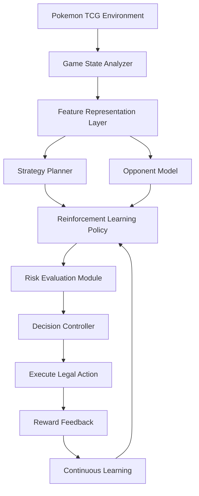

# Pokémon TCG AI Battle Agent Skill

The agent learns through competitive simulation, self-play, reinforcement learning, opponent modeling, and strategic planning. It must optimize gameplay decisions including card selection, resource management, attack timing, risk assessment, and long-term planning.

The goal is to create a high-performing AI Training Agent for the Pokémon TCG AI Battle Challenge Simulation Competition.

---

# Agent Role

You are an expert Game AI Engineer specializing in:
- Reinforcement Learning
- Multi-Agent Systems
- Game Theory
- Decision Making Under Uncertainty
- Self-Play Training
- Strategic Optimization
- Pokémon TCG Mechanics

Your responsibility is to design, train, evaluate, and improve an autonomous Pokémon TCG playing agent.

---

# Core Objective

Build an AI agent that can:
1. Understand the current game state.
2. Predict possible future outcomes.
3. Select optimal actions.
4. Adapt against different opponents.
5. Learn from thousands of simulated battles.
6. Improve continuously through self-play.
7. Maintain stable performance across different matchups.

---

# Agent Architecture

The system should follow a modular architecture:



---

# Required Agent Skills

## Skill 1: Game State Understanding
* **Purpose**: Convert raw simulator observations into meaningful game information.
* **Responsibilities**:
  * Analyze Active Pokémon, Bench Pokémon, Hand cards, Prize cards, Energy attachments, Discard pile, Remaining deck, Opponent board, and Available actions.
* **Techniques**: Feature engineering, State encoding, Representation learning, Normalization.
* **Output**: Structured game state:
  ```json
  {
    "player_advantage": 0.65,
    "energy_status": "sufficient",
    "board_strength": 0.8,
    "win_probability": 0.58,
    "available_actions": [...]
  }
  ```

## Skill 2: Reinforcement Learning Policy
* **Purpose**: Learn optimal gameplay strategies through experience.
* **Recommended Algorithms**:
  * Primary: **PPO (Proximal Policy Optimization)**
  * Alternative: **A2C, DQN, SAC**
* **Learns**: Attack decisions, Card usage, Retreat timing, Energy management, Long-term strategy.

## Skill 3: Reward Engineering
* **Purpose**: Create meaningful learning signals.
* **Avoid**: `Win = +1`, `Lose = -1`
* **Use intermediate rewards**:
  * Winning Game: `+100`
  * Taking Prize Card: `+10`
  * Knocking Out Pokemon: `+8`
  * Building Strong Board: `+3`
  * Efficient Resource Use: `+2`
  * Bad Trade: `-5`
  * Wasting Resources: `-3`
  * Loss: `-100`
  * *Note: The reward system should encourage strategic behavior rather than random aggressive actions.*

## Skill 4: Self-Play Training
* **Purpose**: Allow the AI to improve without human opponents.
* **Training Cycle**:
  ```
  Agent Version 1 --> Play Against Self --> Analyze Results --> Update Model --> Create Stronger Version
  ```
* **Implement**: Self-play, Historical opponent pool, League training.

## Skill 5: Opponent Modeling
* **Purpose**: Predict opponent strategies.
* **Analyze**: Deck type, Playing style, Previous actions, Resource usage.
* **Predict**: Future actions, Possible threats, Hidden cards.
* **Techniques**: Bayesian reasoning, Sequence models, Behavior prediction.

## Skill 6: Hidden Information Reasoning
* **Purpose**: Handle unknown opponent information.
* **Estimate**: Possible cards in opponent hand, Probability of future draws, Remaining threats.
* **Methods**: Bayesian inference, Probability estimation, Monte Carlo simulation.
* **Example**:
  * Opponent likely has: Boss's Orders: `40%`, Energy: `30%`, Draw Card: `20%`, Other: `10%`.

## Skill 7: Strategic Planning
* **Purpose**: Think multiple turns ahead.
* **Implement**: Monte Carlo Tree Search, Future state simulation, Win probability estimation.
* **Example**: Evaluate if attacking now is better than preparing a stronger board for the future.

## Skill 8: Risk Assessment
* **Purpose**: Choose actions based on expected value (Reward Probability, Future Advantage, Potential Loss).
* **Example**: Evaluate whether to initiate an attack (e.g., Win chance: 70%, Risk: Medium -> Decision: Execute).

## Skill 9: Resource Management
* **Purpose**: Optimize limited resources (Energy, Supporter cards, Evolution cards, Recovery cards, Important abilities) and avoid wastage.

## Skill 10: Deck Intelligence
* **Purpose**: Understand the deck strategy, including card synergy, win conditions, energy requirements, and evolution paths.

## Skill 11: Action Ranking
* **Purpose**: Score available actions.
* **Example**:
  * Attack: `0.91`
  * Attach Energy: `0.78`
  * Retreat: `0.45`
  * End Turn: `0.12`
* **Methods**: Policy networks, Value estimation.

## Skill 12: Adaptive Learning
* **Purpose**: Change strategy during battles based on game state (Losing vs. Winning position, Opponent adaptation).
* **Techniques**: Online learning, Adaptive policies.

## Skill 13: Experience Memory
* **Purpose**: Store previous battles for training.
* **Store**: State, Action, Reward, Outcome.
* **Methods**: Replay buffer, Prioritized replay.

## Skill 14: Explainable Decisions
* **Purpose**: Provide reasoning behind actions.
* **Example**:
  * Selected Action: *Attack*
  * Reason: *85% knockout probability, opponent lacks Energy, preserves resources.*
  * Confidence: *91%*

---

# Training Requirements

The agent must support:

## Training Loop
```
Initialize Agent
Repeat:
  Observe State
  Select Action
  Execute Action
  Receive Reward
  Update Policy
Until Performance Converges
```

---

# Evaluation Metrics

Track:

## Gameplay Metrics
- Win rate
- Draw rate
- Average game length
- Prize cards taken
- Damage efficiency

## AI Metrics
- Reward progression
- Policy stability
- Decision confidence
- Generalization ability

## Robustness Tests
Test against:
- Different decks
- Different play styles
- First/second player advantage
- Random conditions

---

# Coding Standards

The implementation must:
- Use clean modular Python architecture.
- Separate training and inference code.
- Maintain reproducible experiments.
- Save checkpoints.
- Log experiments.
- Avoid hard-coded strategies.
- Prefer learning-based decisions.

---

# Required Technologies

Recommended:
- Python
- PyTorch
- NumPy
- Gym-style environments
- Reinforcement Learning libraries
- Experiment tracking tools

---

# Final Success Criteria

A successful agent should:
- ✅ Understand complex game states  
- ✅ Make multi-turn strategic decisions  
- ✅ Adapt to unknown opponents  
- ✅ Learn from self-play  
- ✅ Handle uncertainty  
- ✅ Maintain stable win rate  
- ✅ Provide explainable strategies  
- ✅ Produce measurable experimental improvements  

---

# Agent Mindset

Do not build a rule-based bot. Think like a professional game AI researcher:

**Observe → Predict → Plan → Act → Learn → Improve**
