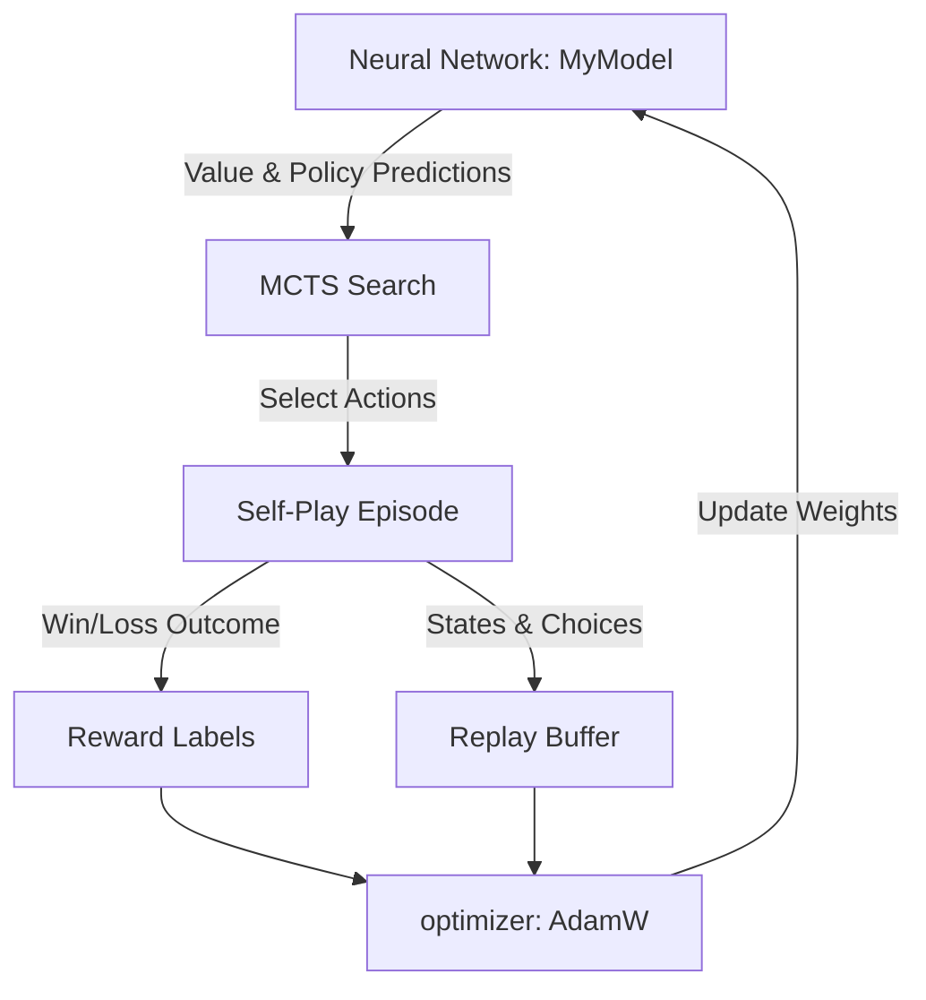

# Pokémon TCG AI: Notebook Code Analysis

This document provides a detailed breakdown of the sample code in [reinforcement-learning-and-mcts-sample-code.ipynb](file:///d:/codingProject/pokemon-tcg-ai-agent/pokemon-tcg-ai-battle-challenge-strategy/reinforcement-learning-and-mcts-sample-code.ipynb). The notebook implements an **Actor-Critic style Reinforcement Learning Agent** enhanced by **Monte Carlo Tree Search (MCTS)** for playing the Pokémon Trading Card Game.

---

## 1. High-Level Architecture

The training framework follows an **AlphaZero-like** paradigm:
1. **Self-Play**: The agent plays against itself. During each turn, it runs **MCTS** (guided by a neural network's policy and value estimates) to search ahead and select moves.
2. **Data Collection**: State observations, MCTS policy distributions, and final game outcomes are recorded.
3. **Training**: The neural network is trained using the collected self-play data to predict both the board state value (expected win rate) and the best actions.
4. **Evaluation**: The agent is evaluated against a random opponent to measure win-rate progression.

---

## 2. Neural Network Design (`MyModel`)

The neural network utilizes a customized sparse Transformer-based architecture:

* **Encoder (State Representation)**:
  * **Input**: A sparse vector representing the entire board state (active Pokémon, bench, hand, prizes, stadium, turn count, discard piles).
  * **Processing**: Uses `EmbeddingBag` (to handle variable-length sparse state features) followed by a `TransformerEncoder`.
  * **Output**: A single value $v \in [-1, 1]$ representing the estimated advantage (win probability) for the current player.

* **Decoder (Action Selector)**:
  * **Input**: Sparse feature vectors representing the list of legally available actions at the current decision point.
  * **Processing**: Attention layers (`MultiheadAttention` in `DecoderLayer`) query the encoder's state output against the action representations.
  * **Output**: Logits $p$ scoring each available legal action.

---

## 3. Sparse State Feature Encoding

Because the state and action spaces are highly variable (e.g. different Pokémon, items, card types, and board counts), the notebook encodes features as **Sparse Vectors** (`SparseVector` class) to feed into PyTorch's `EmbeddingBag`.

### State Encoding (`get_encoder_input`):
* **Pokémon Features**: HP (normalized by 400), card ID, attached tools, and attached energy cards.
* **Player State**: Deck count, discard count, hand count, bench size, prize card count, and special conditions (poisoned, burned, asleep, paralyzed, confused).
* **Game Context**: Current stadium card ID, turn number, and player order (first/second).

### Action Encoding (`get_decoder_input`):
Encodes each available choice index into a sparse representation mapping:
* **Option Types**: Simple actions (END, YES, NO), attacks, or complex card options (PLAY, ATTACH, EVOLVE, ABILITY, DISCARD, RETREAT).
* Uses the target card IDs and context indices to represent the meaning of the choices.

---

## 4. Monte Carlo Tree Search (MCTS)

Instead of choosing actions directly from raw network probabilities, the agent performs a tree search to look ahead at the consequences of decisions:

* **Simulation (`mcts_agent`)**:
  * Utilizes `search_begin()`, `search_step()`, and `search_end()` from the simulator SDK (`cg-lib`).
  * Since opponent hand/deck cards are unknown, it creates a simulated search environment by **randomly sampling** the remaining cards (e.g., assuming opponent cards or deck distribution).
* **Selection Policy (UCB)**:
  * Balances exploration and exploitation during the search:
    $$V_{UCB} = V_{node} + c \cdot \frac{P_{child}}{1 + N_{visit}}$$
  * Here, $P_{child}$ is the prior policy probability from the Decoder, and $N_{visit}$ is the child node's visit count.
* **Backpropagation**:
  * Values are backpropagated up the tree. Wins propagate a value of `1.0`, losses `-1.0`, and draws `0.0`.

---

## 5. Self-Play & Training Loop

The main loop executes 5 iterations containing the following steps:

1. **Evaluation**:
   * Plays 50 games against a `random_agent`.
   * The notebook prints out the win-rate progression (starting at **20%** and rising to **76%** over the logs).
2. **Self-Play (100 episodes)**:
   * Battles are initialized with `battle_start(sample_deck, sample_deck)`.
   * For each step, the MCTS agent generates the best action and saves a `LearnSample`.
3. **Temporal Discounting & Bellman Update**:
   * Uses $\lambda = 0.9$ to smooth value estimates backwards from the final win/loss result.
   * Modifies target action policies based on MCTS visit counts.
4. **Gradient Updates**:
   * Batch training uses `AdamW` with a learning rate of `3e-4`.
   * Combines **Value Loss** (`HuberLoss` on the encoder win prediction) and **Policy Loss** (`HuberLoss` on action scores).

---

## 6. Development Recommendations for High Performance

If you want to transition this notebook code into a finalist-level agent:

1. **Increase Search Iterations**: The default search count `SEARCH_COUNT = 10` is very small. Increasing this will drastically improve planning depth, though it increases time per move.
2. **Improve Opponent Deck Modeling**: Currently, the simulation fills opponent hands/decks with dummy cards (like basic energy and Snorlax). Implementing a Bayesian predictor to guess the opponent's deck composition based on their discarded cards or active Pokémon will yield massive tactical advantages.
3. **Add Parallel Game Simulation**: To collect data faster, run self-play games in parallel using multiprocessing.
4. **Tweak Reward Shaping**: Add the intermediate rewards detailed in your machine learning skill (e.g., rewards for taking prize cards or knocking out opponent Pokémon) to speed up initial learning.
